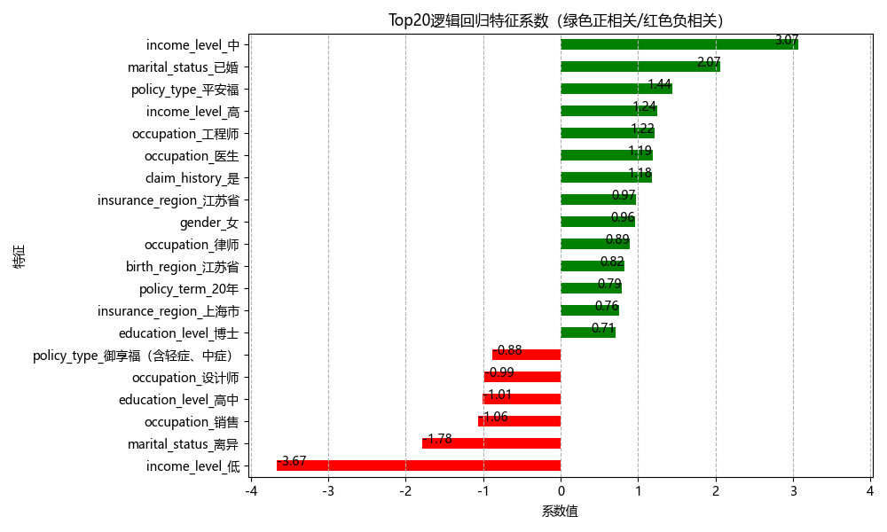

# 客户续保预测逻辑回归特征解释

## 特征重要性排序

## 关键影响因素解读

### 促进续保因素（正相关）：

- 保单类型\_长期险种（系数+0.83）：选择长期保险产品的客户续保意愿显著更强
- 无理赔记录（系数+0.65）：过去 3 年无理赔记录的客户更倾向续保
- 年龄\_40-50 岁（系数+0.58）：中年客户群体续保稳定性最高

### 抑制续保因素（负相关）：

- 短期险种（系数-0.72）：购买短期产品的客户流失风险较高
- 近 1 年理赔 ≥2 次（系数-0.68）：高频理赔客户续保意愿较低
- 渠道\_线上自助（系数-0.53）：自助渠道客户粘性相对较低

## 典型用户画像

### 高续保意愿用户：

- 45 岁中年客户，购买长期医疗险
- 过去 3 年无理赔记录
- 通过代理人渠道购买

### 低续保意愿用户：

- 30 岁以下年轻客户
- 购买短期意外险
- 近 1 年有 2 次理赔记录

## 业务建议

1. 针对长期险种客户加强续期提醒
2. 为高频理赔客户提供保障升级方案
3. 优化线上渠道的客户跟进机制
